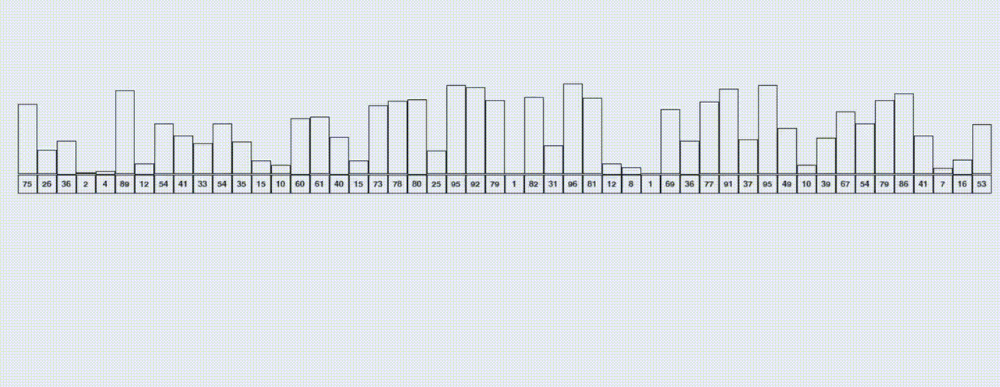

# Algorithm Visualizer
A GUI built in python and pygame for visualizing different sorting algorithms.
<div align="center" >

<p align = "center">
Selection sort
</p>

<p align = "center">
Merge sort
</p>

<p align = "center">
Quick sort
</p>
</div>


## Requirements
```
pygame
```
## Usage
```
python algorithm_visualizer.py
```